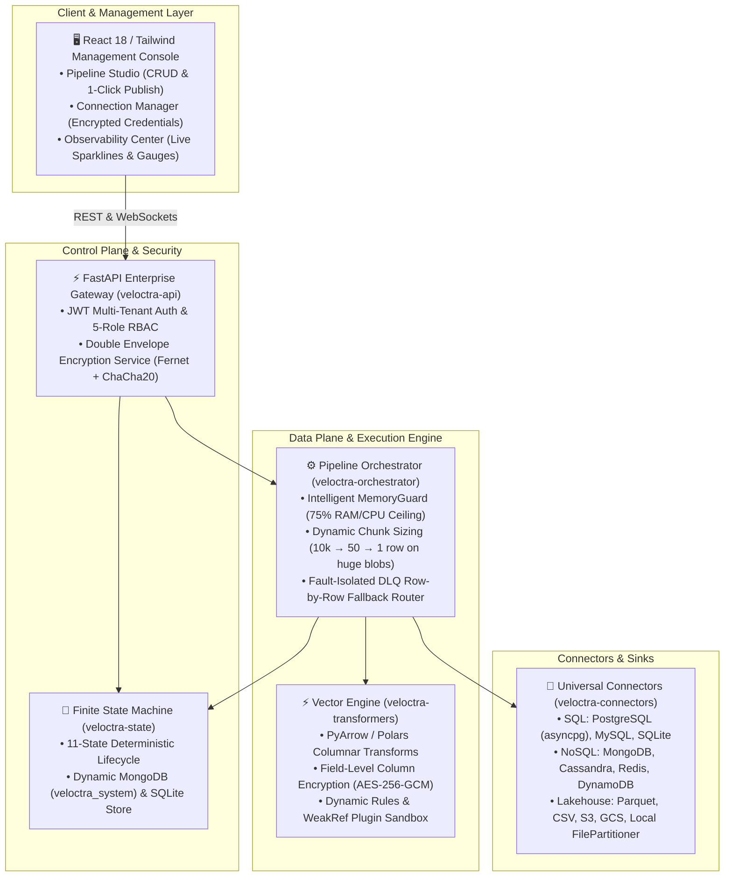

<div align="center">

# ⚡ Veloctra Data Platform
### Enterprise-Grade, Vectorized, Multi-Tenant Data Streaming & Migration Engine

[](LICENSE)
[](https://python.org)
[](https://fastapi.tiangolo.com)
[](https://arrow.apache.org)
[](https://reactjs.org)
[](#-benchmarks--performance)
[](docs/architecture.md)
[](https://vaagatech.github.io/veloctra-data-platform/)

<p align="center">
  <b>High-throughput, memory-governed ETL/ELT platform designed for mission-critical SQL, NoSQL, and Lakehouse pipelines with zero data loss.</b>
</p>

[🌐 Live Documentation](https://vaagatech.github.io/veloctra-data-platform/) • [🚀 Quickstart](#-quickstart) • [🏛️ Architecture](#-system-architecture) • [💡 Why Veloctra?](#-why-veloctra) • [📦 Packages](#-monorepo-structure)

</div>

---

## 🌟 Why Veloctra?

Traditional ETL pipelines (Spark, Airflow, custom Python scripts) suffer from **heavy JVM memory overhead, catastrophic out-of-memory (OOM) crashes, credential leakage in static config files, and brittle batch failures where a single malformed row fails a 10-million record job**.

**Veloctra solves this with an enterprise-hardened, zero-JVM, memory-governed streaming engine:**

```
+---------------------------------------------------------------------------------------------------+
|                                 VELOCTRA vs TRADITIONAL ETL STACKS                                |
+-----------------------------------+-----------------------------------+---------------------------+
| Capability                        | Legacy Stacks (Spark / Airflow)   | Veloctra Data Platform    |
+-----------------------------------+-----------------------------------+---------------------------+
| 🚀 Memory Footprint               | 4GB - 16GB JVM Heap per worker    | < 250 MB Process RSS      |
| 🛡️ Memory Governance              | Brittle OOM kills on big batches  | Intelligent MemoryGuard   |
| 🔒 Security & Credentials         | Plaintext / static environment    | Double Envelope AEAD      |
| 🔄 Corrupt Row Handling           | Entire job crashes & aborts       | Per-record DLQ isolation  |
| ⚙️ State Store Flexibility        | Rigid metadata databases          | MongoDB / SQLite FSM      |
| 🖥️ UI & Modeler                  | Fragmented 3rd party tools        | Built-in Visual Studio    |
| 📈 Live Telemetry                 | Polled or delayed metrics         | 2s Real-Time WebSockets   |
| ⚡ Transformation Speed           | Python row loops (slow)           | PyArrow / C++ Columnar    |
+-----------------------------------+-----------------------------------+---------------------------+
```

---

## 🏛️ System Architecture

Veloctra uses a decoupled monorepo architecture featuring an **11-State Deterministic FSM**, **Vectorized PyArrow C++ Transform Engines**, and **Double Envelope AES-128 + ChaCha20-Poly1305 AEAD Encryption**.



---

## ⚡ Key Platform Features

### 1. 🛡️ Intelligent MemoryGuard (75% Resource Ceiling)
- Continuously monitors OS-level CPU, process RAM, and row payload byte density.
- **Huge Record Detection**: If individual records exceed 100 KB – 5 MB, chunk size is dynamically throttled down to **1 record per chunk**.
- **Critical Resource Backpressure**: If RAM or CPU exceeds 75% or 85%, chunk sizes are halved and explicit Python Garbage Collection (`gc.collect()`) is triggered, reserving $\ge$25% headroom.

### 2. 🔐 Double Envelope Encryption & Zero-Downtime Key Rotation
- **Layer 1**: AES-128-CBC + HMAC-SHA256 (Fernet) with rotating master key.
- **Layer 2**: ChaCha20-Poly1305 AEAD with tenant-scoped Authenticated Additional Data (AAD).
- **KeyRotationManager**: Versioned token structure (`enc:v1:...` $\rightarrow$ `enc:v2:...`) allowing live key rotation without breaking existing pipelines or stored credentials.

### 3. 🎯 Zero Data Loss & DLQ Poison-Pill Isolation
- High-speed vector batch execution by default.
- If a corrupt record is encountered, the orchestrator automatically sub-shards the batch row-by-row (`batch.slice(i, 1)`).
- The poison pill is isolated to the MongoDB Dead Letter Queue (`dlq`) with full stack trace, while all valid records proceed to destination sinks.

### 4. ⚖️ Configurable Dual-Scope Failure Policies (Run & Chunk Thresholds)
- **Policy Modes**: `continue`, `stop_on_failure`, or `threshold`.
- **Dual-Scope Threshold Governance**:
  - **Per-Run Cumulative Safeguard**: Halt execution if total job failure rate exceeds `max_failure_percent` (e.g., 5%) or `max_failure_count`.
  - **Per-Chunk Burst Protection**: Instantly catch sudden data corruption spikes if a single chunk's error rate exceeds `chunk_max_failure_percent` (e.g., 20%) or `chunk_max_failure_count`.
- **Instant Circuit Breakers**: Critical `threshold_breached` events are written to the audit store and raised as `FailureThresholdExceeded` exceptions.

### 5. ⚡ Vectorized Columnar Transforms & Date Formatting
- **Zero-Copy PyArrow / Polars Execution**: Transforms millions of rows per second in C++ native memory without Python object overhead.
- **Smart Date Formatters (`date_format`)**: Converts integer or string representations (e.g., `19230901` $\rightarrow$ `1923-09-01`) with null and boundary-safe parsing.
- **Column Pruning & Projection (`select_columns` / `drop_columns`)**: Minimize bandwidth and storage by selecting and migrating only designated columns.
- **Field-Level Type Casting & Renaming (`rename_field`, `type_cast`)**: Seamlessly map snake_case SQL attributes to camelCase or PascalCase NoSQL document schemas.

### 6. 🌐 Multi-Table & Multi-Database Consolidations
- **Relational to NoSQL Consolidation**: Extract from multiple relational tables across different schemas and merge into a single consolidated MongoDB document (e.g., `unified_patient_claims`).
- **Targeted Multi-Collection Fanout**: Simultaneously route joined records to separate purpose-built collections (`patient_demographics`, `clinical_claims`).
- **Unified End-to-End Lakehouse Pipelines**: Stream directly from compressed archive files (ZIP/GZ) through Arrow transformations and load into PostgreSQL and MongoDB in a single atomic pipeline.

### 7. 📊 Scope-Aware Observability & Completion Snapshot Telemetry
- **Active Streaming**: Live gauges polling CPU utilization, Total/Used RAM, Process RSS Heap, and WebSocket sparklines.
- **Completion Resource Snapshots**: When viewing completed or historic runs, displays the exact CPU and Process RAM allocation at the moment of job completion.
- **Structured Event Audit Trail**: Queryable `pipeline_events` log tracking state transitions, MemoryGuard throttles, and DLQ routing.

### 8. 📥 Direct Pipeline Specification Import & Visual Studio
- Direct drag-and-drop or raw YAML/JSON paste import for instant pipeline onboarding.
- Interactive Light-Mode Studio with visual data modeler, schema discovery, field-level encryption toggles, and 1-click publishing.

---

## 🚀 Quickstart

### Prerequisites
- Python $\ge$ 3.10
- Node.js $\ge$ 18 (for Management UI)
- MongoDB $\ge$ 5.0 (for state management) or local PostgreSQL

### 1. Clone & Install
```bash
git clone git@github.com:vaagatech/veloctra-data-platform.git
cd veloctra-data-platform

# Install Python monorepo dependencies
python3 -m venv .venv
source .venv/bin/activate
pip install -r requirements.txt
pip install -e packages/veloctra-core -e packages/veloctra-security -e packages/veloctra-state -e packages/veloctra-resilience -e packages/veloctra-connectors -e packages/veloctra-transformers -e packages/veloctra-orchestrator -e packages/veloctra-api
```

### 2. Build Management Console
```bash
cd apps/management-ui
npm install
npm run build
cd ../..
```

### 3. Start Engine Daemon
```bash
./start.sh
```

- **Management UI**: [http://localhost:8008](http://localhost:8008)
- **Pipeline Studio**: [http://localhost:8008/studio](http://localhost:8008/studio)
- **Observability Center**: [http://localhost:8008/observability](http://localhost:8008/observability)
- **Interactive API Docs**: [http://localhost:8008/docs](http://localhost:8008/docs)
- **Default Credentials**: `admin` / `changeme`

---

## 📋 Pipeline Configuration Example

Pipelines are declared cleanly in YAML or via the visual Pipeline Studio:

```yaml
id: csv_to_postgres_lakehouse
name: "Medicare Beneficiary Ingestion"
tenant_id: "healthcare_prod"

state_store:
  backend: mongodb
  database: veloctra_system

sources:
  - name: raw_zip_stream
    type: file
    format: csv
    archive_format: zip
    path: "./test_data/RawClaimBenef.csv.zip"
    chunk_size: 10000

transformers:
  rules:
    - field: "clm_id"
      rule: "not_null"
  enrichments:
    - type: "timestamp_utc"
      target_field: "ingested_at"

destinations:
  - name: postgres_lakehouse
    type: database
    connection_string: "env:POSTGRES_PROD_URL"
    table: "raw_claim_benef"
    upsert_key: "id"

  - name: parquet_archive
    type: file
    format: parquet
    output_dir: "./lakehouse_archive"
    max_rows_per_file: 100000
    max_file_size_mb: 100
```

---

## 🚀 Standalone CLI & CI/CD Runner

Pipelines can be executed or validated directly from the terminal or CI/CD pipelines without starting the web server:

```bash
# Validate a pipeline YAML configuration and custom script
python3 veloctra_cli.py validate --config configs/custom_script_pipeline.yaml

# Execute a pipeline run
python3 veloctra_cli.py run --config configs/custom_streaming_plugin.yaml --tenant healthcare_corp

# Check engine version
python3 veloctra_cli.py version
```

---

## ⚡ Pluggable Streaming & Messaging

Veloctra is **not limited to specific message brokers**. Developers can plug in any streaming broker dynamically:
- **Built-in Connectors**: Apache Kafka, RabbitMQ, AWS SQS, and Redis Streams.
- **Dynamic External Plugins**: Drop Python connectors into `plugins/` (e.g. `plugins/custom_nats_connector.py`) and reference via `plugin_file` or `plugin_module`.
- **Ultra-Lightweight Footprint**: Base container starts in **< 40MB RAM** with zero heavy SDKs; broker libraries load on-demand only when invoked.

---

## 🐳 Deployment (Docker & Kubernetes)

### Local Full Stack via Docker Compose
```bash
# Starts Veloctra API, PostgreSQL, MongoDB, Redis Streams, and Prometheus metrics
docker compose up -d
```

### Ultra-Lightweight Kubernetes Pods
```bash
kubectl apply -f deploy/k8s/
```

- **Resource Requirements**: Request `32Mi` RAM / `50m` CPU, Limit `128Mi` RAM / `500m` CPU.
- **Metrics Scraping**: Native Prometheus annotations (`/metrics`) enabled out of the box.

---

## 📦 Monorepo Structure

```
veloctra-data-platform/
├── apps/
│   └── management-ui/              # React 18 + TypeScript Console
├── configs/                        # YAML Pipeline Templates (CDC, Streaming, Scripts)
├── deploy/
│   ├── k8s/                        # Kubernetes Deployment, Service, ConfigMap, Secret
│   └── prometheus.yml              # Prometheus Scrape Configuration
├── docs/                           # GitHub Pages Interactive Documentation Site
├── packages/
│   ├── veloctra-core/              # Configuration & Base Protocols
│   ├── veloctra-security/          # Double Envelope Encryption & RBAC
│   ├── veloctra-state/             # MongoDB / SQLite FSM State Store
│   ├── veloctra-resilience/        # Circuit Breakers & AWS Full Jitter Retry
│   ├── veloctra-connectors/        # Pluggable SQL, NoSQL, File & Streaming Connectors
│   ├── veloctra-transformers/      # SIMD Columnar Transforms, Script Engine & Schemas
│   ├── veloctra-orchestrator/      # MemoryGuard & Stream Orchestrator & Scheduler
│   └── veloctra-api/               # FastAPI REST & WebSocket Telemetry Server
├── plugins/                        # Dynamic Third-Party Connector Plugins
├── scripts/                        # Benchmarks & Ingestion Utilities
├── Dockerfile                      # Multi-Stage Ultra-Lightweight Containerfile
├── docker-compose.yml              # Full-Stack Local Orchestration
├── veloctra_cli.py                 # Standalone CLI Runner
├── start.sh                        # Production Daemon Launcher
└── stop.sh                         # Graceful Shutdown Script
```

---

## 📈 Benchmarks & Performance

Measured on a standard 8-Core Apple Silicon M-series machine (Local SSD & In-Memory IPC):

| Workload | Dataset Size | Engine Throughput | Total Time | Memory Usage |
| :--- | :--- | :--- | :--- | :--- |
| **CSV (Zip) $\rightarrow$ PostgreSQL** | 10,000,000 Rows | **~28,500 rows/sec** | ~5.8 min | < 250 MB |
| **PostgreSQL $\rightarrow$ CSV Lakehouse** | 1,620,000 Rows (431 MB) | **~38,000 rows/sec** | ~42 sec | < 180 MB |
| **In-Memory PyArrow Vector Transform** | 1,000,000 Rows | **~120,000 rows/sec** | ~8.3 sec | < 120 MB |

---

## 🤝 Contributing & License

Contributions are welcome! Distributed under the **Apache 2.0 License**. See `LICENSE` for more information.
