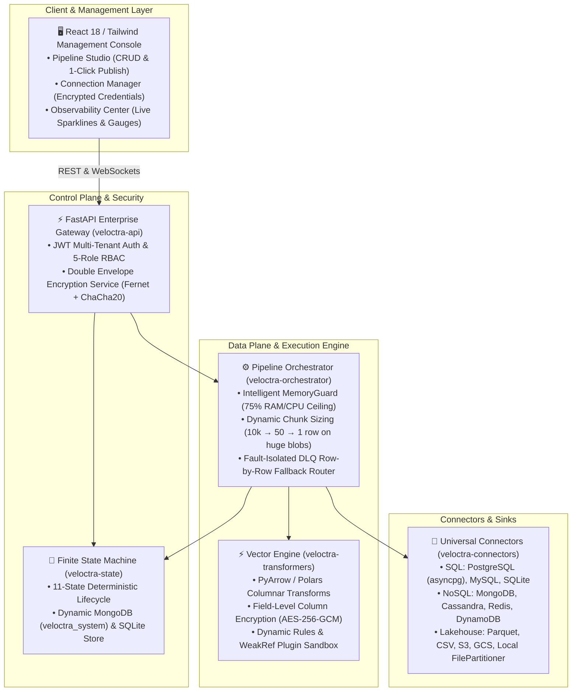
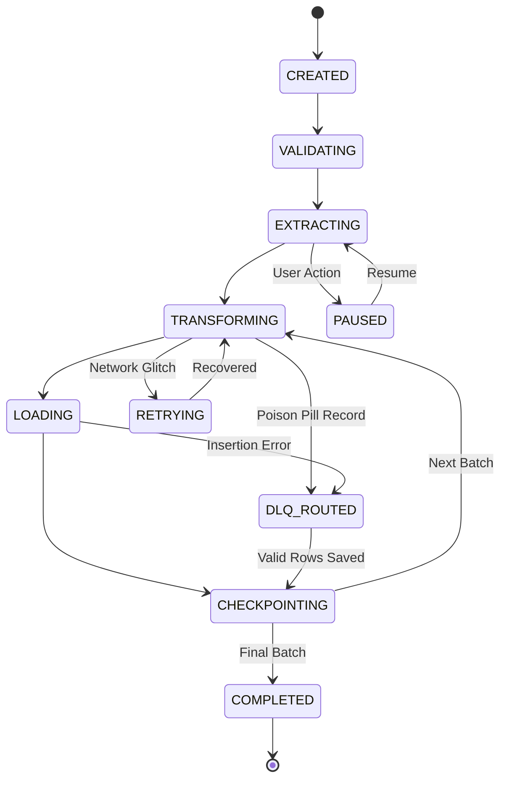

# 🏛️ Veloctra Production Architecture Blueprint

## Architectural Overview

The **Veloctra Data Platform** is built as an enterprise-grade, memory-governed streaming data transformation and migration platform. It follows a decoupled monorepo design where storage connectors, resilience layers, state machines, and vectorised PyArrow transformers communicate via standard protocols.



---

## Package Architecture (Monorepo)

The repository is partitioned into 8 modular packages inside `packages/`:

| Package | Directory | Description |
| :--- | :--- | :--- |
| `veloctra-core` | `packages/veloctra-core` | Environment settings, Pydantic schema validation, and logging. |
| `veloctra-security` | `packages/veloctra-security` | Double Envelope Encryption (Fernet + ChaCha20-Poly1305), KeyRotationManager, 5-role RBAC, and Secret resolution. |
| `veloctra-state` | `packages/veloctra-state` | Deterministic 11-state FSM state machine and MongoDB (`veloctra_system`) / SQLite checkpoint store. |
| `veloctra-resilience` | `packages/veloctra-resilience` | Circuit Breaker automaton (CLOSED/OPEN/HALF_OPEN) and AWS Full Jitter exponential backoff. |
| `veloctra-connectors` | `packages/veloctra-connectors` | Streaming connectors for PostgreSQL, MySQL, SQLite, MongoDB, Cassandra, Redis, DynamoDB, and Universal File System. |
| `veloctra-transformers` | `packages/veloctra-transformers` | PyArrow / Polars columnar vector transformations, AES-256-GCM cipher engine, and auto-sized `FilePartitioner`. |
| `veloctra-orchestrator` | `packages/veloctra-orchestrator` | `PipelineOrchestrator` controller, `MemoryGuard` resource governor, and DLQ row-by-row fallback handler. |
| `veloctra-api` | `packages/veloctra-api` | FastAPI REST endpoints, security header middleware, and WebSocket telemetry broadcaster. |

---

## Finite State Machine (FSM) Transition Matrix

The state machine enforces valid execution flows. Invalid transitions raise `FSMError`:



---

## Double Envelope Encryption & Key Rotation

To protect database DSNs, API keys, and private tokens from filesystem leaks or database breaches, Veloctra enforces **Double Envelope Encryption**:

```
Plaintext Credential / Secret
             │
             ▼
[ Layer 1: Fernet (AES-128-CBC + HMAC-SHA256) with Master Key ]
             │
             ▼
[ Layer 2: ChaCha20-Poly1305 AEAD with Secondary Key + Tenant AAD ]
             │
             ▼
Stored Format: enc:v1:<nonce_b64>:<ciphertext_b64>
```

- **Zero Downtime Key Rotation**: When rotating keys (`v1` $\rightarrow$ `v2`), existing tokens remain decryptable while all new or updated credentials are automatically encrypted under the new active version.

---

## 🛡️ Field-Level Column Encryption (AES-256-GCM)

For HIPAA and GDPR compliance, sensitive PII/PHI columns (e.g. `ssn`, `beneficiary_id`, `credit_card`) are encrypted in-memory within PyArrow vector batches before writing to destinations:
- **Cipher**: AES-256-GCM with 96-bit unique nonces per record and 128-bit authentication tags.
- **Selective Column Policy**: Defined declaratively in pipeline configuration under `settings.encryption.fields_to_encrypt`.

---

## 👥 5-Role Multi-Tenant RBAC Authorization Matrix

| Role | Permissions | Scope |
| :--- | :--- | :--- |
| **SUPER_ADMIN** | Full system control, tenant creation, global key rotation, server metrics. | System-wide |
| **TENANT_ADMIN** | Manage pipelines, connection secrets, and team members within tenant. | Tenant-bound |
| **DATA_ENGINEER** | Create, edit, test, and publish pipeline definitions & transformations. | Tenant-bound |
| **OPERATOR** | Trigger pipeline executions, pause/resume jobs, view logs and DLQ items. | Tenant-bound |
| **AUDITOR** | Read-only access to audit trails, state checkpoints, and compliance logs. | Tenant-bound |

---

## ⚡ Universal Pluggable Streaming & Messaging Architecture

Veloctra features an open, pluggable streaming architecture (`BaseStreamingConnector` and `StreamingConnectorRegistry`):
- **Not Limited to Specific Vendors**: Any messaging/streaming system (**Apache Kafka**, **RabbitMQ**, **AWS SQS**, **Redis Streams**, **NATS**, **Google Cloud Pub/Sub**, **Azure Event Hubs**, **MQTT**, or proprietary message buses) can be integrated seamlessly.
- **Ultra-Lightweight Pod/Edge Footprint (< 40MB RAM)**: Base platform has zero mandatory broker dependencies; heavy client libraries load on-demand only when a connector is invoked.
- **Dynamic File / Module Loading**: Load custom connectors via `plugin_file: "plugins/custom_nats.py"` or `plugin_module: "my_org.connectors.solace"` with runtime hot-loading.
- **Bi-Directional Topologies**: Full support for Database $\leftrightarrow$ Messaging and Messaging $\leftrightarrow$ Messaging zero-broker bridging.

---

## 🐍 Custom Script Transformation Engine (UI & CI/CD Import)

For complex business processing and advanced data transformations beyond basic schema mappings:
- **UI Inline Scripting**: Author Python transformations directly within the UI designer, with live dry-run linting and validation via `POST /scripts/validate`.
- **CI/CD Module Import**: Import repository scripts or enterprise packages via `script_path` or `module_name`.
- **Multi-Framework Support**: Adapters for PyArrow (`pa.RecordBatch`), Pandas (`pd.DataFrame`), Polars (`pl.DataFrame`), and Python dictionary lists.
- **Execution Sandboxing**: Configurable timeout guards (`timeout_seconds`), memory thresholds, and per-record DLQ isolation.

---

## 🛡️ Intelligent MemoryGuard (75% Resource Ceiling)

The `MemoryGuard` protects the host system from out-of-memory crashes by maintaining strict resource governance:
1. **Dynamic Chunk Resizing**: Calculates record byte density per batch. For huge multi-megabyte payloads, chunk size is reduced to **1 record per chunk**.
2. **Resource Backpressure**: If RAM or CPU exceeds 75% or 85%, chunk sizes are halved and explicit Python Garbage Collection (`gc.collect()`) is triggered, reserving $\ge$25% headroom.

