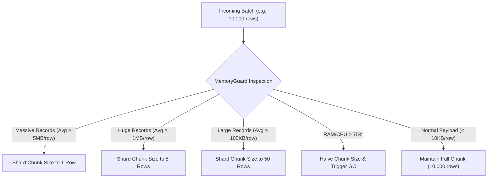

# ⚡ Process Sharding & Data Partitioning in Veloctra

Veloctra implements a **5-layer sharding and partitioning architecture** designed to maximize throughput while guaranteeing memory safety, zero data loss, and seamless horizontal scaling.

---

## 1. Source-Level Cursor & Range Sharding

When ingesting massive tables or file datasets, Veloctra avoids unbounded in-memory loading by using streaming server-side cursors and key range partitioning:

- **SQL Databases (`PostgreSQL`, `MySQL`, `SQLite`)**:
  - Leverages non-blocking server cursors (`asyncpg`, `aiomysql`, `aiosqlite`) to fetch discrete batches of rows.
  - Supports incremental watermark partitioning:
    ```sql
    SELECT * FROM raw_claim_benef WHERE id >= :start_id AND id < :end_id
    ```
- **Files & Compressed Streams (`UniversalFileSystem`)**:
  - Streams large CSV/Parquet files and Zip archives incrementally in chunked buffers via `UniversalFileSystem` without unpacking whole multi-gigabyte files to disk.

---

## 2. In-Flight Adaptive Memory Sharding (`MemoryGuard`)

As batches enter the pipeline, `MemoryGuard` continuously monitors process RAM, OS CPU, and individual record sizes to dynamically adjust chunk boundaries:



---

## 3. Horizontal Process & Job Sharding

- Pipelines execute as decoupled asynchronous worker coroutines identified by unique `job_id` strings (e.g. `csv_to_postgres_4`, `postgres_to_csv_3`).
- Multiple pipeline instances run concurrently across available CPU cores and event loop tasks, completely isolated by tenant ID and job state in MongoDB `veloctra_system`.

---

## 4. Fault-Isolation Sub-Chunking (DLQ Routing)

When a vectorised PyArrow batch of 10,000 rows encounters corrupt or malformed rows:
1. The batch is automatically sub-sharded into single-row slices (`mini_batch = raw_batch.slice(i, 1)`).
2. The failing poison-pill record is captured with stack trace and isolated into the MongoDB Dead Letter Queue (`dlq`).
3. All remaining valid records in the batch are recombined and loaded into the destination with zero data loss or job stoppage.

---

## 5. Destination File Sink Partitioning (`FilePartitioner`)

When exporting high-volume streams to data lakehouses (S3, GCS, or Local Filesystem):
- **Bounded Partitions**: High-throughput streams are automatically split across numbered partition files (`part_00001.parquet`, `part_00002.parquet`, `part_00003.csv`).
- **Trigger Conditions**: A new file is flushed whenever:
  - Row count reaches `max_rows_per_file` (default: 100,000 rows).
  - Or memory volume reaches `max_file_size_mb` (default: 100 MB).
- **Atomic Flushes**: Files are written via atomic write locks (`write_atomic`) to prevent partial or corrupted file artifacts.
